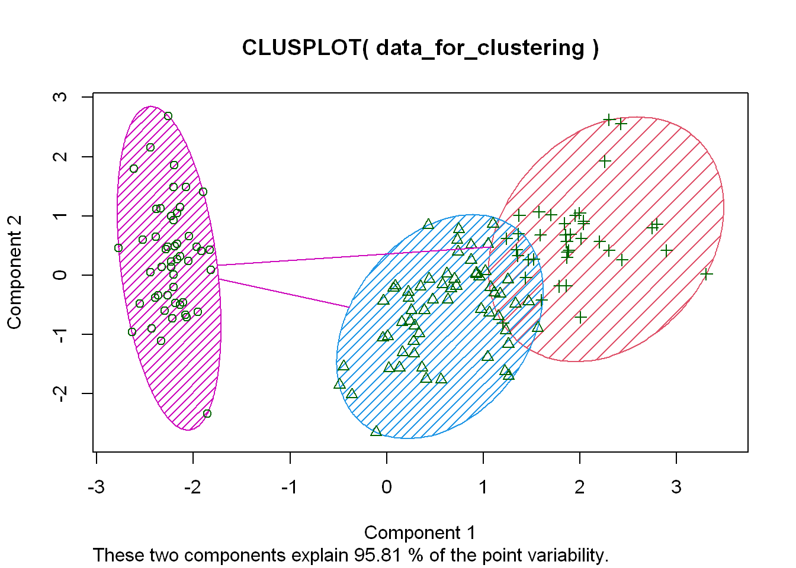

# Iris Data Analysis

The Iris Data set is a multivariate data set. Four features measured from each sample are —sepal length, sepal width, petal length and petal width, in centimeters. Iris data is publicly available to use and is one of the most widely used data set.

The data is also known as Fisher's Iris data set or Anderon's Iris data set. [1] Edgar Anderson collected data to quantify the morphologic variation of Iris flowers of three related species. [2] 

The data set consists of 50 samples from each of three species of Iris (Iris setosa, Iris virginica and Iris versicolor). Four features were measured from each sample: the length and the width of the sepals and petals, in centimeters. Based on the combination of these four features, Fisher developed a linear discriminant model to distinguish the species from each other. [3]

### Goal
The goal of this analysis is to determine if using the available data set can lead towards a prediction system to identify iris flower species when presented with the flower measurements.


### Software
R Studio v.1.3.959

---

```Load Libraries

library(dplyr)
   
   Attaching package: 'dplyr'
   The following objects are masked from 'package:stats':
   
       filter, lag
   The following objects are masked from 'package:base':
   
       intersect, setdiff, setequal, union
library(ggplot2)

library(gridExtra)
   
   Attaching package: 'gridExtra'
   The following object is masked from 'package:dplyr':
   
       combine
library(cluster) 

library(fpc)

library(factoextra)

library(knitr)

```


```Load Dataset Iris

dim(iris)
   [1] 150   5
 Examine dataset information

head(iris, 4)
     Sepal.Length Sepal.Width Petal.Length Petal.Width Species
   1          5.1         3.5          1.4         0.2  setosa
   2          4.9         3.0          1.4         0.2  setosa
   3          4.7         3.2          1.3         0.2  setosa
   4          4.6         3.1          1.5         0.2  setosa
tail(iris, 2)
       Sepal.Length Sepal.Width Petal.Length Petal.Width   Species
   149          6.2         3.4          5.4         2.3 virginica
   150          5.9         3.0          5.1         1.8 virginica


summary(iris)
     Sepal.Length    Sepal.Width     Petal.Length    Petal.Width   
    Min.   :4.300   Min.   :2.000   Min.   :1.000   Min.   :0.100  
    1st Qu.:5.100   1st Qu.:2.800   1st Qu.:1.600   1st Qu.:0.300  
    Median :5.800   Median :3.000   Median :4.350   Median :1.300  
    Mean   :5.843   Mean   :3.057   Mean   :3.758   Mean   :1.199  
    3rd Qu.:6.400   3rd Qu.:3.300   3rd Qu.:5.100   3rd Qu.:1.800  
    Max.   :7.900   Max.   :4.400   Max.   :6.900   Max.   :2.500  
          Species  
    setosa    :50  
    versicolor:50  
    virginica :50  
                   
                   
 
```

```
names(iris)

"Sepal.Length" "Sepal.Width"  "Petal.Length" "Petal.Width"  "Species"

Examine Iris data information

 Chart matrix
pairs(iris[,1:4], col=iris$Species)
```


Initial Results from the chart matrix shows there there appears to be some clustering in the data based on length and width of the sepals and petals of the iris flowers that were measured for the data set.


```Grid analysis of histograms of the Sepal Lengt and Width and the Petal Length and Width.

p1 <- ggplot(aes(x = Sepal.Length, fill = Species), data = iris) +
  facet_wrap(~Species) + geom_histogram()

p2 <- ggplot(aes(x = Sepal.Width, fill = Species), data = iris) +
  facet_wrap(~Species) + geom_histogram()

p3 <- ggplot(aes(x = Petal.Length, fill = Species), data = iris) +
  facet_wrap(~Species) + geom_histogram()

p4 <- ggplot(aes(x = Petal.Width, fill = Species), data = iris) +
  facet_wrap(~Species) + geom_histogram()


grid.arrange(p1, p2, p3, p4, ncol = 2)
   `stat_bin()` using `bins = 30`. Pick better value with `binwidth`.
   `stat_bin()` using `bins = 30`. Pick better value with `binwidth`.
   `stat_bin()` using `bins = 30`. Pick better value with `binwidth`.
   `stat_bin()` using `bins = 30`. Pick better value with `binwidth`.
```


Histograms show some patterns that show some relationship between the widths and lengths of the sepals and petals of the flowers.


```Relook at the relationship between width and length with scatterplot
sp1 <- ggplot(aes(x = Sepal.Length, y = Sepal.Width, color = Species), data = iris) +
  facet_wrap(~Species) + geom_point()

sp2 <- ggplot(aes(x = Petal.Length, y = Petal.Width, color = Species), data = iris) +
  facet_wrap(~Species) + geom_point()


grid.arrange(sp1, sp2, ncol = 1)
```


 Again, at first blush, there appears to be a relationship between length and width of sepals and petals.


```Relook of the Iris data using boxplots


bp1 <- ggplot(aes(x = Petal.Width, y = Petal.Length, color = Species), data = iris) +
  geom_boxplot()

bp2 <- ggplot(aes(x = Sepal.Width, y = Sepal.Length, color = Species), data = iris) +
  geom_boxplot()

grid.arrange(bp1, bp2, ncol = 1)
```


```Cluster analysis of the Iris data.

 Cluster analysis, droping species colum to clean dataset.

data_for_clustering <- iris[,-5] 

 kmeans data clustering partitioning (assuming 3 centers or clusters).

clusters_iris <- kmeans(data_for_clustering, centers = 3) 

 ploting of the final dataset

plotcluster(data_for_clustering,clusters_iris$cluster) 
```


```Another look at clustering of the Iris data.

clusplot(data_for_clustering, clusters_iris$cluster, color = TRUE, shade = TRUE)
```




### Conclusion

Based on the last plot, it appears that there are two cluster groups, Iris setosa, while the other cluster contains both Iris virginica and Iris versicolor. The data provided in the Iris set doesn’t provide enough separation between virginica and versicolor to be used as a predictive model.


### Credits

[1] The Use of Multiple Measurements in Taxonomic Problems. Author: Fisher, Ronald Aylmer, Sir, 1890-1962 https://digital.library.adelaide.edu.au/dspace/handle/2440/15227

[2] The Species Problem in Iris Author: Edgar Anderson (1936). Annals of the Missouri Botanical Garden https://annals.mobot.org/index.php/annals

[3] Iris Flower Data Set https://en.wikipedia.org/wiki/Iris_flower_data_set